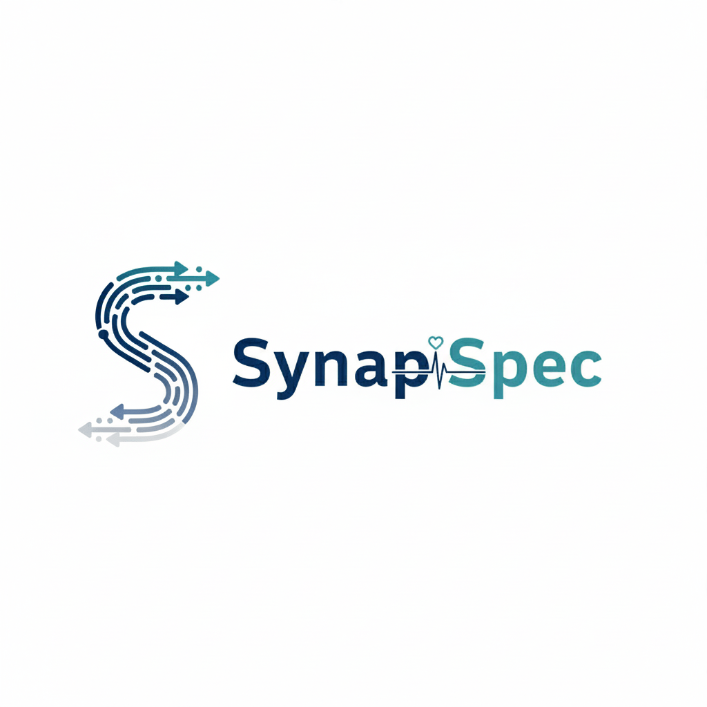

  

<h1 align="center">SynapSpec</h1>

  <strong>Comprehensive proteomics software platform for advanced DIA mass spectrometry data analysis.</strong>
   
  SynapSpec provides powerful analytical capabilities designed for modern proteomics research.

  

---

## Core Features

- **Peptide Identification & Quantification**: Advanced algorithms for accurate peptide identification with robust false discovery rate control and precise quantification across samples
- **Deep Learning-based Spectral Library Generation**: Advanced deep learning models for accurate spectral library prediction and generation, enabling enhanced peptide identification and DIA analysis
- **Label-free Quantification**: Support for both label-free and isobaric labeling methods for multiplexed quantitative proteomics experiments
- **Semi-Specific Support**: Optimized workflows for data-independent acquisition and SWATH-MS analysis with spectral library generation and matching
- **Statistical Analysis & Differential Expression**: Integrated statistical tools for differential expression analysis and multiple testing correction
- **Scalable Multi-Omics Solution**: Developing scalable workflows applicable to diverse research areas including metaproteomics, immunoproteomics, and clinical proteomics for comprehensive biological insights

## Applications

### Biomedical Research
- Protein expression profiling
- Post-translational modification analysis
- Protein-protein interaction studies
- Disease mechanism studies
- Biomarker discovery and validation

### Systems Biology
- Pathway analysis and mapping
- Cellular signaling network analysis
- Time-course proteome dynamics
- Comparative proteomics across conditions

### Clinical Proteomics
- Disease subtype classification
- Patient stratification
- Therapeutic response monitoring
- Prognostic marker identification

## Installation

### Download

Download the latest version from our [releases page](https://github.com/bionsight/SynapSpec/releases):

- **Windows**: `SynapSpec-windows-v0.3.4.msi`
- **macOS**: `SynapSpec-macos-v0.3.4.dmg`
- **Linux**: `SynapSpec-linux-v0.3.4.tar.gz`

### System Requirements

- **Windows**: Windows 10, 11, or Server 2016/2019/2022 (64-bit)
- **macOS**: macOS 10.14 or higher
- **Linux**: Ubuntu 20.04 LTS or higher
- **Memory**: 16 GB RAM minimum, 32GB recommended
- **Storage**: 3GB available disk space
- **Data Processing**: 2 TB or more (2x dataset size recommended)
- **Software Dependencies**: .NET 8.0 or higher, Mono

## Documentation

For detailed usage instructions, tutorials, and API documentation, visit:
**[docs.synapspec.ai](https://docs.synapspec.ai)**

## Support

- **GitHub Discussions**: [Community support and feature requests](https://github.com/bionsight/SynapSpec/discussions)
- **Bug Reports**: [Report issues](https://github.com/bionsight/SynapSpec/issues)
- **Email**: Contact us for enterprise support and collaborations

## Acknowledgements

SynapSpec was inspired by and greatly benefited from the following open-source proteomics projects:

- **[DIA-NN](https://github.com/vdemichev/DiaNN)**: A pioneering tool for DIA proteomics data analysis that demonstrated the power of neural networks in spectral library prediction
- **[alphaDIA](https://github.com/MannLabs/alphadia)**: An innovative deep learning-based DIA analysis platform that advanced the field with transfer learning approaches
- **[OpenMS](https://github.com/OpenMS/OpenMS)**: A comprehensive open-source framework for mass spectrometry data analysis that provided foundational algorithms and workflows

We are grateful to these projects and their contributors for advancing the field of computational proteomics and making their work openly available to the scientific community.

## License & Commercial Use

SynapSpec is free for academic and non-commercial research use. For commercial use, please contact us at [contact@bionsight.com](mailto:contact@bionsight.com).

For detailed license information and terms, please see [LICENSE.md](LICENSE.md).

---

**Visit our website**: [synapspec.ai](https://synapspec.ai)

**Documentation**: [docs.synapspec.ai](https://docs.synapspec.ai)

**Contact:** [contact@bionsight.com](contact@bionsight.com)